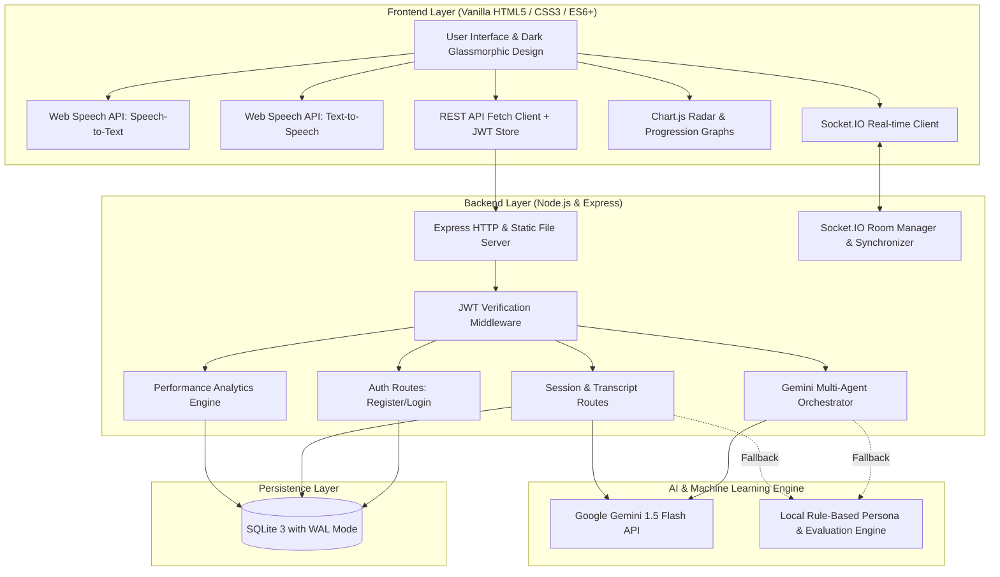
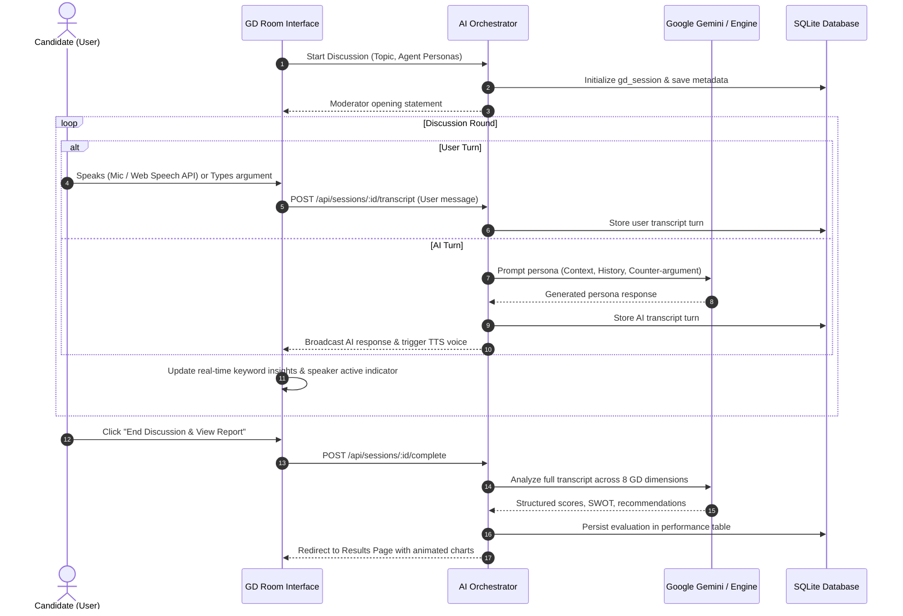

# 🏛️ System Architecture & Workflow

This document details the high-level architecture, module breakdown, multi-agent conversational engine, and evaluation pipeline of the **AI-Based Group Discussion Simulator**.

---

## 🏗️ High-Level System Architecture

---

## 🤖 Multi-Agent AI Simulation Architecture

In **Mode 1: AI Group Discussion**, the user participates with up to 6 autonomous AI agents. Each agent maintains a distinct personality profile, argumentative bias, and behavioral pattern:

### Agent Personas:
1. **Aarav — Constructive Supporter**:
   * Stance: Pro-topic. Emphasizes benefits, opportunities, and forward-looking positive impacts.
2. **Vikram — Critical Challenger**:
   * Stance: Skeptical / Counter-arguments. Probes risks, unintended consequences, and realistic hurdles.
3. **Priya — Analytical Thinker**:
   * Stance: Data-driven and pragmatic. Introduces case studies, facts, and economic dimensions.
4. **Rohan — Mediator & Synthesizer**:
   * Stance: Balanced consensus-builder. Reconciles opposing viewpoints and summarizes agreement areas.

---

## 👥 Real-Time Peer GD Architecture (Human Mode)

In **Mode 2: Human Group Discussion**, WebSockets allow multi-user collaboration in shared virtual rooms:

1. **Room Creation**: Host triggers `room:create` with topic; server allocates a 6-character room code.
2. **Synchronization**: Participants join via `room:join`. Socket.IO broadcasts participant list, connection changes, and mute states.
3. **Discussion Timer**: Server orchestrates an authoritative synchronized countdown timer (`room:timer`) preventing local client drift.
4. **Clean Disconnections**: Graceful handling of peer departures and room memory deallocation upon vacancy.

---

## 📊 Evaluation & Scoring Engine

The scoring engine processes candidate transcripts across **8 distinct dimensions**:

$$\text{Overall Score} = \sum_{i=1}^{8} w_i \cdot S_i$$

* **Communication ($w = 0.15$)**: Clear expression, diction, absence of abrupt sentence fragmentation.
* **Fluency ($w = 0.15$)**: Words per minute, pace consistency, filler-word penalty ($\text{filler count} \times 1.5$).
* **Vocabulary ($w = 0.10$)**: Lexical diversity, topic-specific terminology, professional idiom usage.
* **Content Quality ($w = 0.20$)**: Evidence of logical structure (Premise $\to$ Evidence $\to$ Conclusion).
* **Confidence ($w = 0.10$)**: Direct language, assertive voice cadence, absence of excessive hedging.
* **Leadership ($w = 0.10$)**: Opening initiative, steering drifting topics, framing summaries.
* **Teamwork ($w = 0.10$)**: Active listening phrases (*"Building on that"*, *"I agree with Priya's point"*).
* **Critical Thinking ($w = 0.10$)**: Evaluation of trade-offs, nuanced synthesis of counter-arguments.

---

## 🛡️ Reliability & Offline Resilience

To ensure flawless offline demos or environments with restricted external internet access:
* **Hybrid Fallback Engine**: If no Gemini API key is configured or network requests encounter timeouts, the platform automatically falls back to an internal natural language evaluation engine.
* **Zero External Framework Lock-in**: Vanilla JS and standard Web APIs ensure rapid load times, zero build-step overhead, and compatibility across modern browsers.
