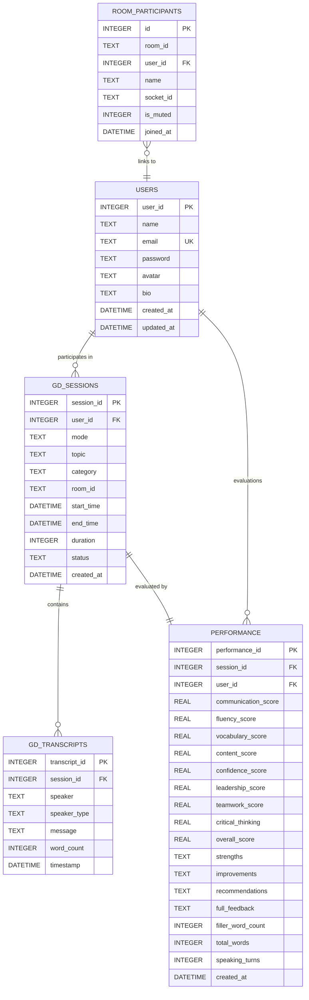

# 🗄️ Database Schema Documentation

The **AI-Based Group Discussion Simulator** utilizes **SQLite 3** running with **Write-Ahead Logging (WAL)** mode enabled for concurrency and high read/write performance.

---

## 📐 Entity-Relationship Overview

---

## 📑 Table Specifications

### 1. `users` Table
Stores authenticated candidate profiles and credentials.

| Column | Type | Constraints | Description |
| :--- | :--- | :--- | :--- |
| `user_id` | INTEGER | PRIMARY KEY AUTOINCREMENT | Unique user identifier |
| `name` | TEXT | NOT NULL | User's full name |
| `email` | TEXT | UNIQUE NOT NULL | User's unique login email |
| `password` | TEXT | NOT NULL | Bcrypt salted password hash |
| `avatar` | TEXT | DEFAULT 'default' | Avatar icon or image key |
| `bio` | TEXT | DEFAULT '' | Optional candidate bio |
| `created_at` | DATETIME | DEFAULT CURRENT_TIMESTAMP | Account creation timestamp |
| `updated_at` | DATETIME | DEFAULT CURRENT_TIMESTAMP | Last profile modification |

---

### 2. `gd_sessions` Table
Records every Group Discussion practice or peer room session.

| Column | Type | Constraints | Description |
| :--- | :--- | :--- | :--- |
| `session_id` | INTEGER | PRIMARY KEY AUTOINCREMENT | Unique session identifier |
| `user_id` | INTEGER | NOT NULL, FK -> users(user_id) | Candidate initiating session |
| `mode` | TEXT | NOT NULL, CHECK in ('ai', 'human') | AI Mode vs Peer Human Mode |
| `topic` | TEXT | NOT NULL | Full topic text |
| `category` | TEXT | DEFAULT 'General' | Topic domain (Tech, Economy, etc.) |
| `room_id` | TEXT | NULLABLE | 6-character room code if Human Mode |
| `start_time` | DATETIME | NULLABLE | Actual timestamp session started |
| `end_time` | DATETIME | NULLABLE | Actual timestamp session completed |
| `duration` | INTEGER | DEFAULT 0 | Total elapsed speaking seconds |
| `status` | TEXT | CHECK in ('active', 'completed', 'abandoned') | Current session lifecycle state |
| `created_at` | DATETIME | DEFAULT CURRENT_TIMESTAMP | Session initialization timestamp |

---

### 3. `gd_transcripts` Table
Sequential record of all dialogue spoken during a discussion session.

| Column | Type | Constraints | Description |
| :--- | :--- | :--- | :--- |
| `transcript_id`| INTEGER | PRIMARY KEY AUTOINCREMENT | Unique turn identifier |
| `session_id` | INTEGER | NOT NULL, FK -> gd_sessions(session_id) | Parent session |
| `speaker` | TEXT | NOT NULL | Speaker display name |
| `speaker_type` | TEXT | CHECK in ('user', 'ai', 'system') | Classification of participant |
| `message` | TEXT | NOT NULL | Transcribed speech or typed argument |
| `word_count` | INTEGER | DEFAULT 0 | Count of words in turn |
| `timestamp` | DATETIME | DEFAULT CURRENT_TIMESTAMP | Precise speech timestamp |

---

### 4. `performance` Table
Comprehensive multi-dimensional evaluation results calculated by AI.

| Column | Type | Constraints | Description |
| :--- | :--- | :--- | :--- |
| `performance_id`| INTEGER | PRIMARY KEY AUTOINCREMENT | Unique evaluation identifier |
| `session_id` | INTEGER | UNIQUE NOT NULL, FK -> gd_sessions | Associated session |
| `user_id` | INTEGER | NOT NULL, FK -> users | User being evaluated |
| `communication_score` | REAL | DEFAULT 0 | Clarity & expression (0-100) |
| `fluency_score` | REAL | DEFAULT 0 | Flow & grammar (0-100) |
| `vocabulary_score` | REAL | DEFAULT 0 | Word choice & phrasing (0-100) |
| `content_score` | REAL | DEFAULT 0 | Logic & argumentation (0-100) |
| `confidence_score` | REAL | DEFAULT 0 | Assertiveness & presence (0-100) |
| `leadership_score` | REAL | DEFAULT 0 | Guiding & moderating (0-100) |
| `teamwork_score` | REAL | DEFAULT 0 | Listening & etiquette (0-100) |
| `critical_thinking` | REAL | DEFAULT 0 | Counter-argument analysis (0-100) |
| `overall_score` | REAL | DEFAULT 0 | Weighted composite score (0-100) |
| `strengths` | TEXT | JSON ARRAY | Top identified strong areas |
| `improvements` | TEXT | JSON ARRAY | Constructive action items |
| `recommendations`| TEXT | JSON ARRAY | Long-term training advice |
| `full_feedback` | TEXT | DEFAULT '' | In-depth paragraph diagnosis |
| `filler_word_count`| INTEGER | DEFAULT 0 | Instances of "um", "ah", "like" |
| `total_words` | INTEGER | DEFAULT 0 | Candidate total words spoken |
| `speaking_turns` | INTEGER | DEFAULT 0 | Candidate participation count |
| `created_at` | DATETIME | DEFAULT CURRENT_TIMESTAMP | Timestamp evaluated |

---

## ⚡ Database Optimizations & Indexes

The following indexes are automatically applied on startup:
* `idx_sessions_user`: Fast lookups for dashboard & user session histories.
* `idx_transcripts_session`: High-speed sequential transcript fetching for evaluation and review.
* `idx_performance_user`: Rapid aggregation of historical competency averages.
* `idx_room_participants_room`: Instant room membership checks during WebSocket joins.
